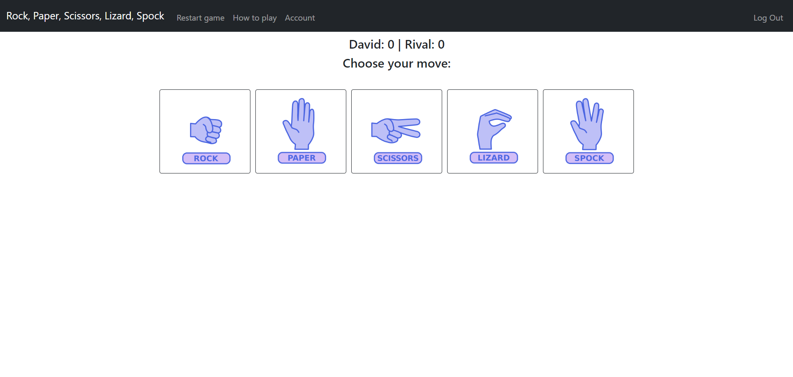

# Rock Paper Scissors Lizard Spok

#### Video Demo:  https://www.youtube.com/watch?v=syDlcw_8Llw

## Description:

A man VS computer version of the hit sitcom "The Big Bang Theory" game of Rock, Paper, Scissors, Lizard, Spok.

The project is built in flask and contains multiple endpoints that can be accessed from within the website, as well as a navigation bar to interact with the site:

### navbar:

The navigation bar, coded within `layout.html`, contains the following links:

When not signed in:
- Link to welcome page
- Link to restart game
- Link to rules page
- Link to log into account
- Link to register account

When signed in:
- Link to welcome page
- Link to restart game
- Link to rules page
- Link to account page
- Link to log out from account

### /:

The root endpoint, coded within `index.html`, is the welcome screen of the site. It contains a link to play as a guest, as well as one to log in and one to register.

### /login:

Endpoint where a user with an account logs in. Coded within `login.html`, when the button is pressed, a POST request is sent to the server, which in turn checks if the provided data matches the database. It redirects to `/account` if login is successful. If login fails, it prompts the user to correct their mistake.

In this example, the user *David* gets logged in with the password *0000*.

### /logout:

Endpoint that clears the user's session and redirects to welcome page.

### /register:

Endpoint where a new user creates a new account. Coded within `register.html`, when the button is pressed, a POST request is sent to the server, which in turn checks if the provided username does not exist in the database. If successful, it creates a new line in the database and stores the username, a hash of the password, and creates an ID number and sets all stats to zero. It then redirects to `/account` . If failed, it prompts the user to correct their mistake.

### /account:

This endpoint has a table with the ranking of all players in the database, a pie chart that depicts how often you used each move, and links to change username, change password, and a link to `/game`.

### /rules:

This endpoint contains an embeded video to the scene in the show where the rules ar explained, as well as an ilustration that explains it and each winning move in text. The site ends with a link to `/game`.

### /game:

This is the main part of the website, contained within `game.html` where the player will choose their move to go up against the computer. The computer selects a random move to play. Once the player has chosen their move, it redirects to `/winner`, providing this template with the data of the current scores, the player's username, who won, and what move were played.

### /winner:

This screen, contained within `winner.html`, shows who won the round, and what moves were played. The user has a choice between going another round and ending the match. If the player chooses to continue, they are redirected to `/game`. If they chose to end the game, they are redirected to `/end`.

### /end:

If the player chooses to end the game, they are redirected to this endpoint, contained within `endgame.html`. Here the winner of the overall game is declared, and the player is asked if they want to play again. They have a choice between going again, getting redirected to `/game` and having the scores set to zero; changing players, getting logged out and redirected to the welcome page; or not playing again, getting redirected to `/account`.

### /restart:

When the player presses the Restart game link in the navbar, they are redirected to `/restart`, contained within `restart.html`, where they are asked if they want to change players. If the player chooses yes, they are logged out and redirected to the welcome page. If they choose no, they will be redirected to `/game`, where they continue logged in, but start the game with all scores set to zero.
