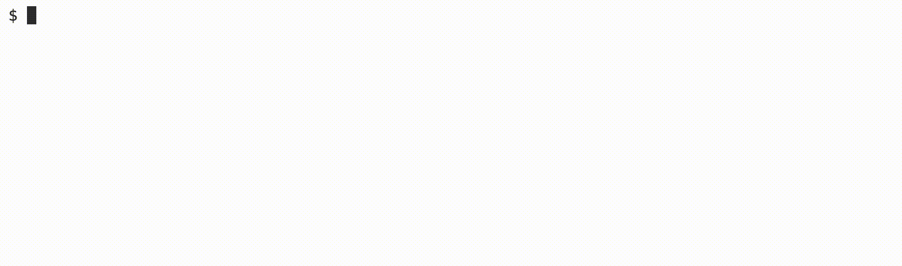

# Half

### Learning Goals

- Work with different data types
- Practice type casting
- Use math operations
- Create a function with input parameters and return value

### Background

Suppose you are eating out at a restaurant with a friend and want to split the bill evenly. You may want to anticipate the amount you’ll owe before the bill arrives with tax added. In this problem, you’ll complete a function to calculate the amount each of you owes based on the bill amount, the tax, and the tip.

> **Hints**
>
> Note that the tax and tip are input as percents. You may want to change these to decimal values before calculating the total.
>
> Since the tip is input as an int, keep in mind that if you divide an ``int`` by an ``int`` you’ll get back an ``int``!
>
> Order of operations here is exactly the same as in algebra, where multiplcation and division are performed before addition and subtraction.


### Demo



### Implementation Details

Your function should use the input parameters, bill, tax, and tip, to calculate the final amount. However, since these values are percentages, you’ll have to do some work to convert these to more appropriate formats to use for your calculation.

The tax should be added to the bill amount before calculating the tip. Finally, you will return exactly half of the full amount, including the bill amount, the tax and the tip.

### How to Test Your Code
Your program should behave per the examples below.

```
half/ $ ./half
Bill before tax and tip: 12.50
Sale Tax Percent: 8.875
Tip percent: 20
You will owe $8.17 each!
```

```
half/ $ ./half
Bill before tax and tip: 23.50
Sale Tax Percent: 7  
Tip percent: 15
You will owe $14.46 each!
```

```
half/ $ ./half
Bill before tax and tip: 100
Sale Tax Percent: 6.25
Tip percent: 18
You will owe $62.69 each!
```
