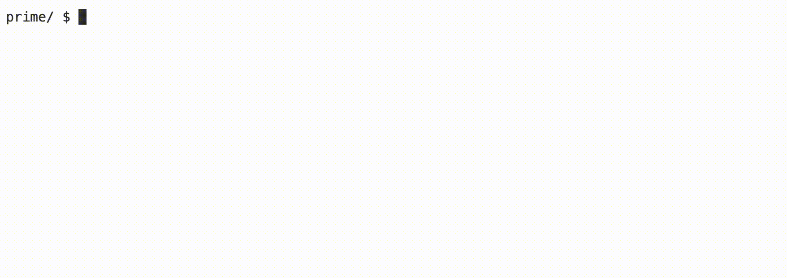

# Prime

### Learning Goals

- Practice using for loops
- Using modulo
- Creating a Boolean function


### Background
Prime numbers are defined as whole numbers greater than 1, whose only factors are 1 and itself. So 3 is prime because its only factors are 1 and 3, while 4 is composite and not prime, because it is the product of 2 × 2. In this lab you will write an algorithm to generate all prime numbers in a range specified by the user.

> **Hints**
>
> Modulo may come in handy, as it produces the remainder when dividing two integers.
>
> By definition, 1 is not a prime number.
>
> There is only one even prime number, 2.

### Demo



### Implementation Details

The easiest way to check if a number is prime, is to try dividing it by every number from 2 up to, but not including, the number itself. If any number divides into it with no remainder, that number is not prime.

The ``main`` function in the distribution code contains a ``for`` loop that iterates through the range specified by the user, with both ends inclusive. For example, if the user types in ``1`` for ``min`` and ``100`` for ``max``, the ``for`` loop will test each number, 1 to 100. Each of these numbers is passed to a function, ``prime``, that you will implement to return either ``true`` or ``false`` depending on whether the number is prime.

### How to Test Your Code

Your program should behave per the examples below.

```
prime/ $ ./prime
Minimum: 1
Maximum: 100
2
3
5
7
11
13
17
19
23
29
31
37
41
43
47
53
59
61
67
71
73
79
83
89
97
```