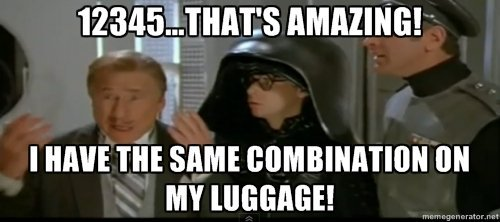

# Password

## Learning Goals

- Practice iterating through a string
- Practice using the ctype library
- Practice using Boolean variables

## Background



As we all know by now, it’s important to use passwords that are not easy to guess! Many web apps now require passwords that require not only alphabetical characters, but also number and symbols.

In this lab, the user is prompted for a password, which will then be validated using a function check that you will complete. If the password contains at least one upper case letter, one lower case letter, a number, and a symbol (meaning a printable character that’s not a letter or number, such as ‘!’, ‘$’ and ‘#’), the function should return ``true``. If not it should return ``false``.

>Hints
>
> The ``ctype`` library has many useful functions that can come in handy here.
>
> Boolean variables can keep track of whether each criteria in an algorithm is valid.

Demo


## Implementation Details

Your function will iterate through the password that’s supplied to it as an argument. Since you have to find at least one lower case letter, one upper case letter, one number and one symbol, you may want to create a boolean variable for each and set each to ``false`` before you iterate through the string. If you then find a number, for instance you can set that boolean to ``true``. If all booleans are ``true`` at the end of the function, it means all criteria are met, and you would return ``true``.

## How to Test Your Code

Your program should behave per the examples below.

```
password/ $ ./password
Enter your password: hello
Your password needs at least one uppercase letter, lowercase letter, number and symbol!
```

```
password/ $ ./password
Enter your password: h3ll(
Your password needs at least one uppercase letter, lowercase letter, number and symbol!
```

```
password/ $ ./password
Enter your password: h3LL0!
Your password is valid!
```